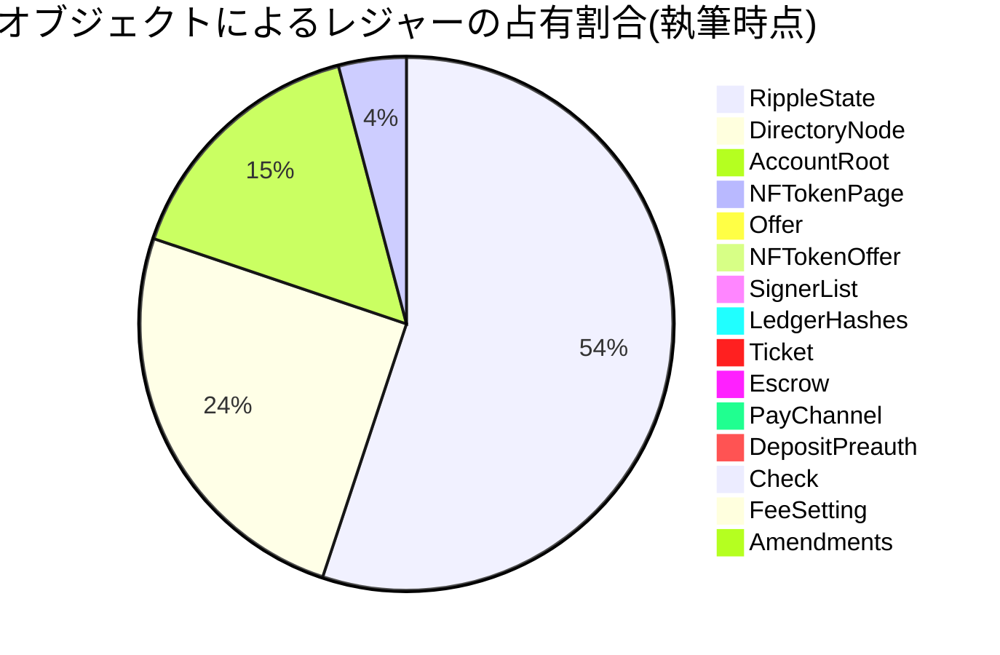

<!--
title:   XRPLの手数料投票
tags:    Blockchain,XRPLedger,web3,xrp,xrpl
id:      9d2e7d1f521f69a1ddae
private: false
-->

# はじめに

XRPレジャーは、分散型台帳技術を採用したブロックチェーンの1つです。XRPレジャーは3人の開発者によって開発され、現在もXRPL財団やRipple社、XRPL Labsなどを始めとしたXRPLコミュニティによって開発が続けられています。
この記事では、XRPレジャーのスパム対策としての手数料の仕組みについて解説します。

https://xrpl.org/ja/transaction-cost.html

# XRPレジャーの手数料

XRPレジャーではいくつかの種類の手数料が存在します。これらは**ネットワークを健全に保つための仕組み**であり、ユーザは適切な利用の範囲内ではほぼゼロに近い手数料でXRPレジャーを利用することが出来ます。

使用した手数料はバリデータに分配されることはなく、ネットワークから完全に焼却されます。

## リファレンス手数料

トランザクションを送信するために手数料として必要とする最低限のXRP量です。
「最低限必要となるトランザクション手数料」とほとんど同じものと考えても良いでしょう。

執筆時点でメインネットではリファレンス手数料の額は0.000010XRP(10drops)となっています。

リファレンス手数料はXRPレジャーをスパムやDoS攻撃から守るための仕組みであり、ネットワークの負荷とともに増加するように設計されています。

https://github.com/XRPLF/rippled/blob/release/src/ripple/app/misc/FeeEscalation.md#fee-escalation

実際のコストはトランザクションを送信するノードの負荷によって決定されますが、リファレンス手数料を下回ることはできません。

トランザクション送信時の`Fee`フィールドの値がリファレンス手数料未満の場合、そのトランザクションは送信ノードによって弾かれるため、コンセンサスの対象になりません。

```jsx :トランザクションの例
{
  "TransactionType" : "Payment",
  "Account" : "rf1BiGeXwwQoi8Z2ueFYTEXSwuJYfV2Jpn",
  "Destination" : "ra5nK24KXen9AHvsdFTKHSANinZseWnPcX",
  "Amount" : {
  "currency" : "USD",
  "value" : "1",
    "issuer" : "rf1BiGeXwwQoi8Z2ueFYTEXSwuJYfV2Jpn"
  },
  "Fee": "12",
  "Flags": 2147483648,
  "Sequence": 2,
}
```

## アカウント準備金

アカウントを使用する上で必要となる準備金であり必要準備金とも呼ばれます。準備金は手数料とは異なり焼却されずに一時的に利用不可なものとしてレジャー上にロックされます。

執筆時点でアカウント準備金の額は10XRP(10,000,000drops)となっています。

アカウント準備金を保有していないアカウントはXRP残高を始めとする一切のデータがレジャー上に存在しません。他のアカウントからアカウント準備金分のXRPをアドレスに送金することでアカウントのデータがレジャー上に作成されます。

https://xrpl.org/ja/accounts.html#アカウントの作成

これはアカウントのスパム作成を防ぎ、レジャーサイズの肥大化を防ぐための仕組みとなっています。

アカウントの削除(AccountDeleteトランザクション)を行うことでアカウント準備金の一部(8XRP)を取り戻すことができます。

https://xrpl.org/ja/accounts.html#アカウントの削除

## 所有者準備金

アカウントがオブジェクト(データ)を所有するために必要な準備金です。アカウント準備金と同様、焼却されることはなく、レジャー上にロックされます。

執筆時点でアカウント準備金の額は2XRP(2,000,000drops)となっています。

XRPレジャーではDEXへの注文を表すOfferオブジェクトや、トークンの保有限度額を表しトラストラインとも呼ばれるRippleStateオブジェクトなど特定のデータを表すオブジェクトが存在します。これらオブジェクトのほとんどはアカウントから送信されるトランザクションによって作成され、そのアカウントの所有するオブジェクトとして表されます。

このようなオブジェクトはレジャー上のデータであるため、アカウントは自身が所有するオブジェクト分の使用料として準備金が必要となります。トランザクションを通して、オブジェクトを削除する/削除されることで準備金を取り戻すことができます(アカウント準備金とは異なり、準備金の全額を取り戻すことが出来ます。)。

この準備金が存在しない場合、アカウントはDEXへの注文を多量に作成することが出来てしまい、レジャーサイズの肥大化を引き起こしてしまいます。

https://xrpl.org/ja/reserves.html#所有者準備金



# 手数料決定の仕組み

XRP Ledgerにおける手数料や準備金の額はバリデータによる**オンレジャーのガバナンス投票**によって決定されます。投票はフラグレジャーという256毎のレジャーを基準に行われます。

各バリデータは自身のUNLに設定したバリデータからの投票を集計し、バリデータの設定値との妥協を図ります。妥協の結果、設定値に変更がある場合は、フラグレジャーの次のレジャー(フラグレジャー+1)に`SetFee疑似トランザクション`を送信します。

他のバリデータも同様に同一設定の`SetFee擬似トランザクション`を送信していた場合、フラグレジャー+1のコンセンサスラウンドを通過し、検証済みのレジャーに含まれることになります。

UNLの80%超のバリデータが同一設定の`SetFee疑似トランザクション`を送信していない場合は、コンセンサスラウンドを通過することはなく、手数料の変更も行われません。

https://xrpl.org/ja/fee-voting.html

https://xrpl.org/ja/setfee.html

# 現在の手数料を取得する

XRPレジャーの現在の手数料情報を取得するには`fee`メソッドを使用します。

https://xrpl.org/ja/fee.html

```js
const { Client } = require('xrpl');

const client = new Client('wss://xrpl.ws');

client.connect().then(() => {
  client
    .request({
      command: 'fee',
    })
    .then((response) => {
      console.log(response.result);
    });
});
```

```js
{
  current_ledger_size: '46',
  current_queue_size: '0',
  drops: {
    base_fee: '10',
    median_fee: '5000',
    minimum_fee: '10',
    open_ledger_fee: '10'
  },
  expected_ledger_size: '141',
  ledger_current_index: 79203954,
  levels: {
    median_level: '128000',
    minimum_level: '256',
    open_ledger_level: '256',
    reference_level: '256'
  },
  max_queue_size: '2820'
}
```

`drops`フィールドを確認することで現在の手数料を確認することができます。

最小限の負担でトランザクションを送信したい場合は`base_fee`、少なくともトランザクションキューに入るようにトランザクションを送信したい場合は`minimum_fee`、トランザクションキューに入らずに直接トランザクションを送信したい場合は`open_ledger_fee`を使用すると良いでしょう(それぞれを保証する値ではありません)。

## まとめ

本記事では、XRPレジャーの手数料の仕組みについて解説しました。トランザクション手数料や準備金はネットワークを健全に保つために必要な仕組みであり、これによりユーザが大きな負担なくXRPレジャーを利用することができるのです。
またこの手数料はバリデータによるオンレジャーのガバナンス投票で決められているという点も面白いでしょう。

XRP Ledgerに興味がある方は開発者Discordチャンネルへ是非お越しください！
日本語チャンネルもありますので、英語が出来なくても大丈夫です！

https://discord.gg/aBH9MwcsbR
